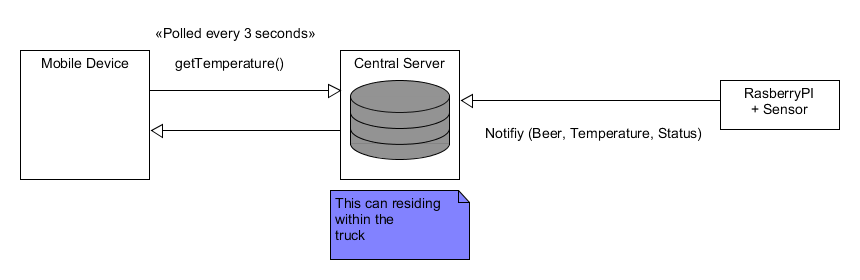

Running the Project
--------------------
1) Prerequisite: Have Gradle and Java 8 Installed.
2) Build the project
   c:\pragmabrewery>gradle build
3) Run the server
   c:\pragmabrewery>gradle bootrun
4) Access the page: http://localhost:8080/
5) Access Unit Tests: http://localhost:8080/UnitTests.html

What were the questions you would ask and your own answers/assumptions?
------------------------------------------------------------------------

<h4>Question: How does the complete solution look like ? How do all the parts fit ?</h4>
Answer: The System Architecture is as follows:

Using RasberryPI, connected to temperature sensors ( https://github.com/ControlEverythingCommunity/MCP9805 ),
will notify the central server with the "beer name" , "temperature", and the "status".
i.e. Each Sensor(PI and Sensor Device) is configured to have the minimum and maximum temperature. If the temperature falls out of this range,then the sensor will notify the central server, of the "beer container", "temperature", and the "status".

The Central Server (Java / SpringBoot Services) will contain two REST services 
   <ol>
     <li> A service that accepts, the {"beer", "temperature" and "status"} from the sensors.</li>
     <li> A service that will return the full list of beer categories and their statuses.</li>
   </ol>

A Mobile/Tablet Device on the Truck will poll every 5 seconds to fetch the beer temperature and status data from the central server.

What are the highlights of your logic?
---------------------------------------
The java code written is for the central server. Even though the sensors, will notify this service of the "beer", "temperature"
and "status", I have written an extra validation class "BeerStatusValidator". This is a singleton class, which will contain
the beer temperature rules logic. Ideally these rules can be retrieved from a configurable store, like database or properties file.

Code Writing Style
--------------------
+ Unit testable Front-end and Back-end code
+ Code follows 'Separation of concerns' style. Relevant classes are placed in its ideal packages.
+ The front end pages are decoupled from the backend services, following a REST architecture.

What could have been done in a better way? What would you do in version 2.0?
----------------------------------------------------------------------------
+ A more 'eye catching' user interface with sound enabled for clearer notifications when temperature changes.
+ The central backend server will store historical information (i.e. with time info) of the temperature captured from each device.

